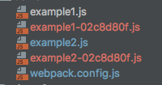
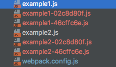
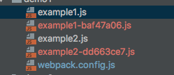

# webpack-demo
as to webpack,I always do not have an intensive study,this time, I want to have some insight into webpack,good luck to myself

## `webpack`中的`hash`问题
简单的项目目录如下图所示：


当`webpack`中的配置文件如下的时候：
```js
  module.exports = {
      entry: {
          'example1': './example1',
          'example2': './example2'
      },
      output: {
          filename: '[name]-[hash:8].js'
      }
  };
```
第一次执行`webpack`命令的时候，会出现下面的目录：


但是当改变example1.js和example2.js中的任何一个文件的时候，然后再执行`webpack`,就会看到下面的目录：


可以看到目录中又新添了两个文件，并且两个文件名的`hash`值是一样的。这里又一个弊端，就是没有改变的那个文件，也会生成一个新的`hash`值的文件名。这是因为`hash`字段是根据每次编译
`compilation`的内容计算得到，也就是整个文件的`hash`值，这样的编译方式明显不太好，没有改变的文件也会随着其他文件的改变而改变
解决上面的问题有如下几种方式：
### 使用`chunkhash`
配置文件如下所示：
```js
module.exports = {
    entry: {
        'example1': './example1',
        'example2': './example2'
    },
    output: {
        filename: '[name]-[chunkhash:8].js'
    }
};
```
执行`webpack`之后，文件目录如下所示：


改变example1.js之后，然后再执行`webpack`，目录结构如下所示：


这样就解决了上面的问题。但是当加入css文件之后，文件目录如下：
