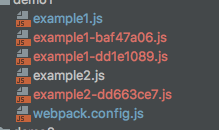
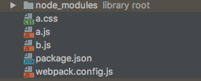
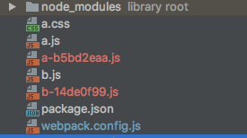
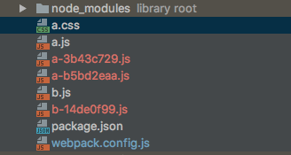
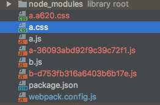
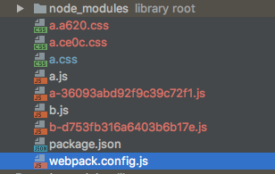
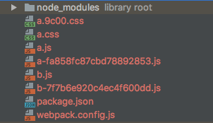
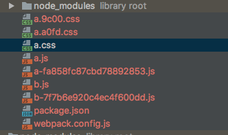
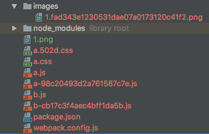

# webpack-demo

## `webpack`中的`hash`问题
简单的项目目录如下图所示：


当`webpack`中的配置文件如下的时候：
```js
  module.exports = {
      entry: {
          'example1': './example1',
          'example2': './example2'
      },
      output: {
          filename: '[name]-[hash:8].js'
      }
  };
```
第一次执行`webpack`命令的时候，会出现下面的目录：


但是当改变example1.js和example2.js中的任何一个文件的时候，然后再执行`webpack`,就会看到下面的目录：


可以看到目录中又新添了两个文件，并且两个文件名的`hash`值是一样的。这里又一个弊端，就是没有改变的那个文件，也会生成一个新的`hash`值的文件名。这是因为`hash`字段是根据每次编译
`compilation`的内容计算得到，也就是整个文件的`hash`值，这样的编译方式明显不太好，没有改变的文件也会随着其他文件的改变而改变
解决上面的问题有如下几种方式：
### 使用`chunkhash`
配置文件如下所示：
```js
module.exports = {
    entry: {
        'example1': './example1',
        'example2': './example2'
    },
    output: {
        filename: '[name]-[chunkhash:8].js'
    }
};
```
执行`webpack`之后，文件目录如下所示：


改变`example1.js`之后，然后再执行`webpack`，目录结构如下所示：



这样就解决了上面的问题。但是当加入css文件之后，文件目录如下：



并且在`a.js`中引入`a.css`,如下所示：
```js
require('./a.css')
```

webpack的配置文件如下所示：
```js
module.exports = {
    entry: {
        'a': './a',
        'b': './b'
    },
    output: {
        filename: '[name]-[chunkhash:8].js'
    },
    module: {
        loaders:[
            {
                test: /\.css$/, // Only .css files
                use: ["style-loader", "css-loader"] // Run both loaders
            }
        ]
    }
};
```
执行`webpack`之后，目录结构变成如下：



改变a.css之后再执行`webpack`

发现文件目录变成如下：



从目录可以看出，文件打包没有打包出`css`文件，而且只要修改`a.css`,那么`a.js`也会发生改变，所以`chunkhash`在含有`css`依赖的时候就会有问题

### `contenthash`

将`webpack`配置修改如下：
```js
const extractTextPlugin = require('extract-text-webpack-plugin');
const webpack = require('webpack');

module.exports = {
    entry: {
        'a': './a',
        'b': './b'
    },

    output:{
        filename:'[name]-[chunkhash].js'
    },
    module: {
        loaders: [{
            test: /\.css$/,
            loader: extractTextPlugin.extract({ fallback: 'style-loader', use: 'css-loader' })
        }],
    },
    plugins: [
        // 这里的 contenthash 是 ExtractTextPlugin 根据抽取输出的文件内容计算得到
        new extractTextPlugin('[name].[contenthash:4].css'),
    ],
}
```
执行`webpack`后的文件目录：



然后改变`a.css` 文件之后，再执行`webpack`，可以看到文件目录如下：



看到目录下只是生成了改变的新的`css`文件，达到目的.

### 使用`webpackMd5Hash`插件
webpack的配置如下：
```js
const webpack = require('webpack');
const extractTextPlugin = require('extract-text-webpack-plugin');
const WebpackMd5Hash = require('webpack-md5-hash')

module.exports = {
    entry: {
        'a': './a',
        'b': './b'
    },

    output:{
        filename:'[name]-[chunkhash].js'
    },
    module: {
        loaders: [{
            test: /\.css$/,
            loader: extractTextPlugin.extract({ fallback: 'style-loader', use: 'css-loader' })
        }],
    },
    plugins: [
        new extractTextPlugin('[name].[contenthash:4].css'),
        new WebpackMd5Hash()
    ],
}
```
文件目录如下图所示：



修改a.css之后，文件目录变成如下所示：



可以看出，当a.css发生改变的时候，依赖它的其他文件并没有重新生成新的hash值，所以使用`webpackMd5Hash`也可以解决问题
`webpackMd5Hash`通过模块路径来排序chunk的所有依赖模块，并将这些排序后的模块源代码拼接，最后用MD5拼接后内容的```chunkhash```,
但是webpackMd5Hash有一些issue，有一些坑，具体可以参见[这里](https://github.com/erm0l0v/webpack-md5-hash/issues/5)还有[这里](https://github.com/erm0l0v/webpack-md5-hash/issues/7)

### 图片的hash问题
在文件中难免会用到图片，比如在文件目录中，a.css文件代码如下：
```css
a{
    font-size:14px;
    background:url('./1.png') no-repeat;
}
```

a.js中的文件代码如下：
```js
require('./1.png');
require('./a.css')
require('./b.js')
var a = 'this is a';
```

`webpack`配置如下：
```js
const webpack = require('webpack');
const extractTextPlugin = require('extract-text-webpack-plugin');
const WebpackMd5Hash = require('webpack-md5-hash')

module.exports = {
    entry: {
        'a': './a',
        'b': './b'
    },

    output:{
        filename:'[name]-[chunkhash].js'
    },
    module: {
        loaders: [
            {
            test: /\.css$/,
            loader: extractTextPlugin.extract({ fallback: 'style-loader', use: 'css-loader' })
            },
            {
                // 图片加载器，雷同file-loader，更适合图片，可以将较小的图片转成base64，减少http请求
                // 如下配置，将小于8192byte的图片转成base64码
                test: /\.(png|jpg|gif)$/,
                loader: 'url-loader?limit=1000&name=../images/[name].[ext]?[hash]',
            }
        ],
    },
    plugins: [
        new extractTextPlugin('[name].[contenthash:4].css'),
        new WebpackMd5Hash()
    ],
}
```
执行webpack之后，目录结构如下图所示：



可以看出图片也有相对应的编译文件，当图片的大小小于1000时，就不会创建相应的`imags`目录，只有大于1000时才会生成。当该目录的`css`和`js`发生改变的时候，也不会重新出现新的`image`图片