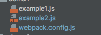

# webpack-demo
as to webpack,I always do not have an intensive study,this time, I want to have some insight into webpack,good luck to myself

## `webpack`中的`hash`问题
简单的项目目录如下图所示：




当`webpack`中的配置文件如下的时候：
```js
  module.exports = {
      entry: {
          'example1': './example1',
          'example2': './example2'
      },
      output: {
          filename: '[name]-[hash:8].js'
      }
  };
```
第一次执行`webpack`命令的时候，会出现下面的目录：


但是当改变example1.js和example2.js中的任何一个文件的时候，然后再执行`webpack`,就会看到下面的目录：


可以看到目录中又新添了两个文件，并且两个文件名的`hash`值是一样的。这里又一个弊端，就是没有改变的那个文件，也会生成一个新的`hash`值的文件名。这是因为`hash`字段是根据每次编译
`compilation`的内容计算得到，也就是整个文件的`hash`值，这样的编译方式明显不太好，没有改变的文件也会随着其他文件的改变而改变
解决上面的问题有如下几种方式：
### 使用`chunkhash`
配置文件如下所示：
```js
module.exports = {
    entry: {
        'example1': './example1',
        'example2': './example2'
    },
    output: {
        filename: '[name]-[chunkhash:8].js'
    }
};
```
执行`webpack`之后，文件目录如下所示：


改变`example1.js`之后，然后再执行`webpack`，目录结构如下所示：


这样就解决了上面的问题。但是当加入css文件之后，文件目录如下：


并且在`a.js`中引入`a.css`,如下所示：
```js
require('./a.css')
```

webpack的配置文件如下所示：
```js
module.exports = {
    entry: {
        'a': './a',
        'b': './b'
    },
    output: {
        filename: '[name]-[chunkhash:8].js'
    },
    module: {
        loaders:[
            {
                test: /\.css$/, // Only .css files
                use: ["style-loader", "css-loader"] // Run both loaders
            }
        ]
    }
};
```
执行`webpack`之后，目录结构变成如下：


改变a.css之后再执行`webpack`

发现文件目录变成如下：


从目录可以看出，文件打包没有打包出css文件，而且只要修改a.css,那么a.js也会发生改变，所以chunkhash在含有css依赖的时候就会有问题

### contenthash

将webpack配置修改如下：
```js
const extractTextPlugin = require('extract-text-webpack-plugin');
const webpack = require('webpack');

module.exports = {
    entry: {
        'a': './a',
        'b': './b'
    },

    output:{
        filename:'[name]-[chunkhash].js'
    },
    module: {
        loaders: [{
            test: /\.css$/,
            loader: extractTextPlugin.extract({ fallback: 'style-loader', use: 'css-loader' })
        }],
    },
    plugins: [
        // 这里的 contenthash 是 ExtractTextPlugin 根据抽取输出的文件内容计算得到
        new extractTextPlugin('[name].[contenthash:4].css'),
    ],
}
```
执行webpack后的文件目录：


然后改变a.css 文件之后，再执行webpack，可以看到文件目录如下：


看到目录下只是生成了改变的新的css文件，达到目的.

### 使用`webpackMd5Hash`插件
webpack的配置如下：
```js
const webpack = require('webpack');
const extractTextPlugin = require('extract-text-webpack-plugin');
const WebpackMd5Hash = require('webpack-md5-hash')

module.exports = {
    entry: {
        'a': './a',
        'b': './b'
    },

    output:{
        filename:'[name]-[chunkhash].js'
    },
    module: {
        loaders: [{
            test: /\.css$/,
            loader: extractTextPlugin.extract({ fallback: 'style-loader', use: 'css-loader' })
        }],
    },
    plugins: [
        new extractTextPlugin('[name].[contenthash:4].css'),
        new WebpackMd5Hash()
    ],
}
```
文件目录如下图所示：


修改a.css之后，文件目录变成如下所示：


可以看出，当a.css发生改变的时候，依赖它的其他文件并没有重新生成新的hash值，所以使用`webpackMd5Hash`也可以解决问题

